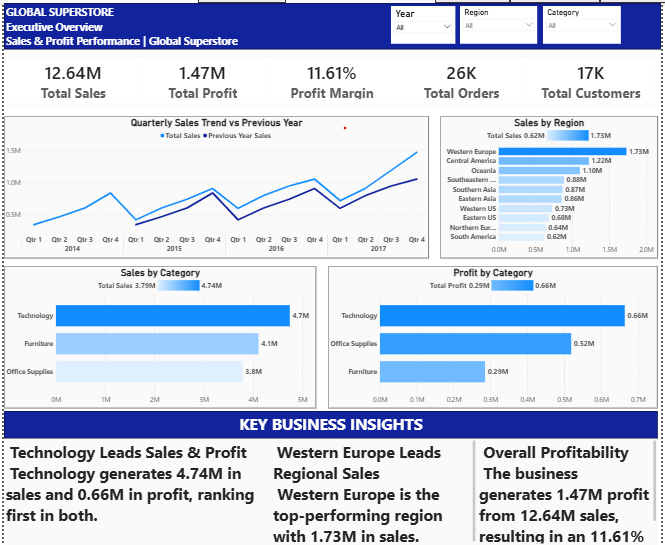

# Global Superstore Sales & Profitability Analysis

## 📊 Project Overview

An interactive Power BI business intelligence project built using the Global Superstore dataset to analyze sales performance, profitability, regional performance, customer segments, product performance, and loss-making transactions.

The project transforms transaction-level sales data into an interactive analytical solution using Power Query, data modeling, DAX measures, and business-focused dashboard design.

## 🎯 Business Problem

Sales revenue alone does not provide a complete picture of business performance.

The objective of this project is to identify:

- Where revenue is generated
- Which markets and regions perform strongly
- Which product categories and products drive sales and profit
- Which customer segments contribute most to revenue
- Where profitability is being lost
- Which areas require management attention

## 🎯 Project Objectives

- Analyze overall sales and profitability performance
- Track sales trends and year-over-year performance
- Evaluate market and regional performance
- Analyze category and sub-category performance
- Evaluate customer segment contribution
- Identify high-performing and loss-making products
- Analyze loss-making orders
- Generate data-driven business insights
- Develop actionable business recommendations

## 🛠️ Tools & Technologies

- **Power BI**
- **Power Query**
- **DAX**
- **Data Modeling**
- **Star-Schema Approach**
- **GitHub**

## 📁 Dataset

**Source:** Global Superstore dataset obtained from Kaggle

**Data Type:** Transaction-level sales data

**Primary Fact Table:** `Orders`

**Orders Table:** 51,290 records

**Supporting Tables:**
- `Dim_Date`
- `Dim_Customer`
- `Dim_Product`
- `People`
- `Returns`

**Key Fields:**
- Order ID
- Order Date
- Customer ID
- Customer Name
- Product
- Category
- Sub-Category
- Sales
- Quantity
- Profit
- Discount
- Region
- Market
- Segment

## 🔄 Data Preparation & Transformation

Power Query was used to transform the raw dataset into analysis-ready tables.

Key transformations included:

- Promoted headers
- Applied appropriate data types
- Removed unnecessary columns
- Created a dedicated customer dimension
- Removed duplicate customer records
- Created a dedicated product dimension
- Removed duplicate product records
- Restructured date-related information
- Created Year, Month, Month Name, Quarter, Day and Day Name fields
- Prepared the transformed tables for data modeling and reporting

## 🧩 Data Model

The project uses a relational data model with the `Orders` table as the primary fact table and supporting dimension tables for date, customer, product, and other analytical attributes.

The model follows a **star-schema approach**, with one-to-many relationships between relevant dimension tables and the `Orders` fact table.

### Model Components

| Table | Role |
|---|---|
| `Orders` | Fact table containing transaction-level sales, quantity and profit data |
| `Dim_Date` | Date dimension for time-based analysis and time intelligence |
| `Dim_Customer` | Customer-level analysis |
| `Dim_Product` | Product, category and sub-category analysis |
| `People` | Supporting regional/people information |
| `Returns` | Return-related analysis |

## 📐 DAX & Analytical Measures

DAX was used to create reusable measures for KPI calculation, profitability analysis, time intelligence, ranking and business-specific analysis.

### Core KPIs
- Total Sales
- Total Profit
- Total Orders
- Total Customers
- Total Quantity
- Average Order Value

### Profitability Analysis
- Profit Margin
- Total Loss
- Loss-Making Orders
- Loss-Making Sales
- High Profit Sales

### Time Intelligence
- Previous Year Sales
- Sales YTD
- YOY Growth %

### Ranking & Contribution
- Top Market Name
- Top Market Sales
- Top Region Sales
- Category Sales %
- Region Sales %

### Business-Specific Measures
- Technology Sales
- Western US Technology Sales

### Key DAX Concepts Applied

- `CALCULATE`
- `FILTER`
- `VALUES`
- `DIVIDE`
- `SAMEPERIODLASTYEAR`
- `TOTALYTD`
- `ADDCOLUMNS`
- `TOPN`
- `MAXX`
- Variables using `VAR`

## 📊 Dashboard

The Power BI report contains three interactive dashboard pages designed to provide different levels of business analysis.

### 1. Executive Overview

Provides a high-level view of overall business performance, including sales, profit, profit margin, orders, customers, quarterly trends, regional performance and category performance.

---

### 2. Sales & Regional Analysis

Analyzes sales performance across markets, regions and customer segments to identify major revenue contributors and regional opportunities.

---

### 3. Profitability & Product Analysis

Evaluates profitability across categories, sub-categories and products, with specific focus on loss-making orders and products.

---

### Data Model

The Power BI data model uses a fact-and-dimension structure to support interactive analysis and DAX calculations.

## 🔎 Key Business Insights

1. **Overall Performance:** The business generated approximately **$12.64M in sales** and **$1.47M in profit**, resulting in an overall profit margin of **11.61%**.

2. **Market & Regional Performance:** **Asia Pacific** was the leading market with approximately **$4.0M in sales**, while **Western Europe** was the strongest individual region with approximately **$1.73M** in sales.

3. **Category Performance:** **Technology** was the largest sales-generating category with approximately **$4.7M in sales**.

4. **Customer Segment:** The **Consumer segment** generated approximately **$6.51M**, contributing **51.48% of total sales**.

5. **Category Profitability:** Technology generated approximately **$4.7M in sales and $0.7M in profit**, while Furniture generated approximately **$4.1M in sales but only $0.3M in profit**, indicating a profitability gap.

6. **Loss-Making Orders:** **6,307 orders** were identified as loss-making, representing approximately **24% of orders** and contributing a combined loss of **$849.32K**. These orders were associated with approximately **$2.37M in sales**.

7. **Product-Level Profitability:** The **Motorola Smart Phone, Cordless** generated approximately **$73K in sales** while recording approximately **$4.4K in negative profit**, demonstrating that high sales do not always translate into profitability.

8. **Sales Trend & Seasonality:** The sales trend shows overall growth across the available reporting periods, with a recurring pattern of stronger **Q4** performance followed by a **Q1 decline**.

## 💡 Business Recommendations

### 1. Reduce Loss-Making Orders

Conduct a detailed review of the 6,307 loss-making orders to identify the products, sub-categories, regions and customer segments contributing most to the $849.32K loss. Prioritize corrective actions such as pricing, discount and cost optimization in the highest-impact loss areas.

### 2. Improve Furniture Profitability

Conduct a profitability deep-dive on the Furniture category across regions, sub-categories and products. Evaluate sales, profit margins, discounts and relevant cost drivers to identify the factors behind its relatively low profit contribution.

### 3. Review High-Sales, Loss-Making Products

Identify high-sales products that generate negative profit and evaluate their pricing, discount levels and associated costs. For consistently loss-making products, assess whether pricing or discount adjustments or changes to promotional strategy are financially justified.

### 4. Evaluate Regional Performance

Evaluate regional performance using both sales and profitability before allocating additional resources. Prioritize regions that demonstrate strong revenue together with healthy profit margins.

### 5. Strengthen Consumer-Segment Strategy

The Consumer segment contributes 51.48% of total sales. Analyze Consumer purchasing patterns, product preferences and regional performance to identify sustainable growth opportunities while managing concentration risk.

### 6. Improve Seasonal Planning

Use the observed Q4 sales peak and Q1 decline to improve seasonal planning by aligning inventory, sales targets and promotional activity with historical demand patterns.

## 🧠 Skills Demonstrated

### Technical Skills
- Power BI
- Power Query
- DAX
- Data Cleaning & Transformation
- Data Modeling
- Star-Schema Design
- KPI Development
- Time Intelligence
- Interactive Dashboard Development
- Data Visualization

### Analytical Skills
- Sales Analysis
- Profitability Analysis
- Regional Analysis
- Product Analysis
- Customer Segment Analysis
- Trend & Seasonality Analysis
- Loss-Making Order Analysis
- Business Insight Generation
- Data Storytelling
- Business Recommendations

## 📁 Project Files

| File / Folder | Description |
|---|---|
| `Global_Superstore_Final` | Final Power BI report |
| `Global_Superstore_Project_Documentation.docx` | Detailed project documentation |
| `Dashboard_Screenshots/` | Dashboard and data-model screenshots |
| `README.md` | Project overview and analysis summary |

## 🎯 Project Outcome

This project demonstrates an end-to-end Power BI analytical workflow:

**Raw Data → Power Query → Data Model → DAX → Interactive Dashboards → Business Insights → Recommendations**

The analysis focuses not only on reporting what happened, but also on identifying profitability risks, performance drivers and potential areas for business improvement.

## 📌 Conclusion

The Global Superstore project demonstrates how transaction-level business data can be transformed into an interactive decision-support solution using Power BI.

The combination of data preparation, dimensional modeling, DAX analysis, dashboard development and business interpretation provides a complete analytical workflow suitable for sales and profitability reporting.

